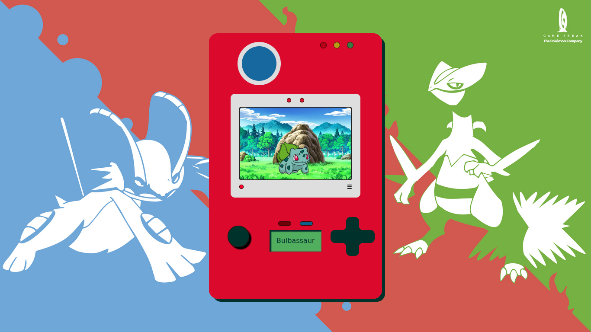

  

<h3 align="center">Pokedéx</h3>

## Table of Contents
- [Live](#live)
- [About](#about)
- [Getting Started](#getting_started)
- [Usage](#usage)
- [Project Live](#project_live)
- [Authors](#authors)
- [TODO](./TODO.md)

## Live Preview
Project Link: https://pokedex-otfhowb2s-davidsilvatrabalho.vercel.app

## About 

This project shows you all the pokemons and their abilities in battle against each other.

## Getting Started 

These instructions will get you a copy of the project up and running on your local machine for development and testing purposes. 

Clone this project into your pc using "git clone https://github.com/DavidSilvaTrabalho/pokedex.git into your home directory => "~/" ex: "git clone https://github.com/DavidSilvaTrabalho ~/".

## Installing 

cd ~/pokedex && npm install 

## Usage 

Come soon!

## Authors 

- [@DavidSilvaTrabalho](https://github.com/DavidSilvaTrabalho) - Idea & Initial work

## Todo

[x] => change display information about pokemon dynamically
[x] => feth on click and get pokemon by its id or name
[x] => Improve desing 
[] => Implements the battle mode 
